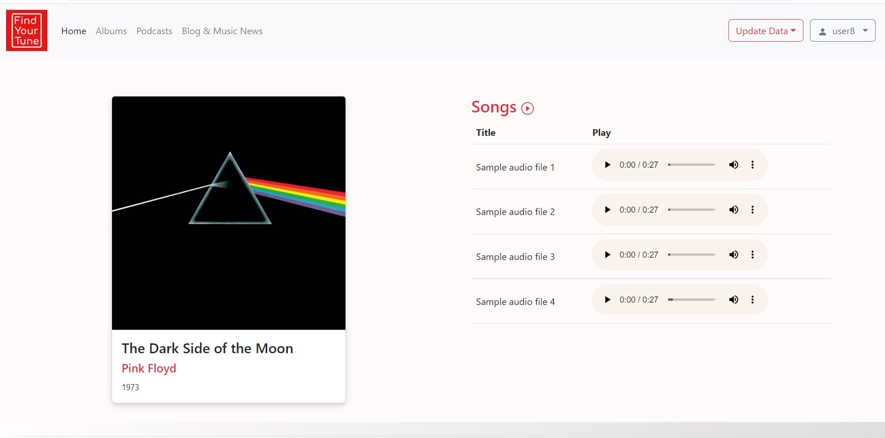

# Find Your Tune

## About
Find Your Tune is a full stack web application that allows a registered user to browse music collection and listen to songs or podcasts. I build it from scratch to practice back-end development skills. The goal was to build a simple music app (something like Apple Music or Spotify) to the best of my current level of programming skills.

I later on added a separate news module to enhance user experience and add additional entertainment feature.

### Main layout
  
### Songs layout
  
### Layout for data management
  
### Menu for data management
  

## Key Features:

*  Built using Node/Express for the back-end
*  Built interface using Handlebars view engine to render data visually in the browser using .hbs views and layouts
*  Used a combination of Bootstrap and customs CSS to style the app
*  Image/sound files are stored at Cloudinary
*  Postgres database on the server to store all the data added by user
*  Client Sessions and data persistence using MongoDB to add user registration and Login/Logout functionality & tracking (logging)
*  Password storage logic includes hashed passwords using bcrypt.js

# Main frameworks/libraries used:

* `Node.js`
* `Express`
* `Handlebars.js`
* `PostgreSQL`
* `MongoDB`
* `Bcrypt.js`

## Requirement
- Git (to clone the repo)
- [Node.js](https://nodejs.org/en/)
- [Cloudinary Account](https://cloudinary.com/)

## Resources 
- [Album Art Finder](https://bendodson.com/projects/itunes-artwork-finder/)
- [Music News](https://www.nme.com/news/music)

## Local Development 
1. Clone this repo - `git clone https://github.com/e-bechmanis/yourTune.git`
2. Copy `sample.env` to `.env` and customize as needed with Cloudinary API keys - `cp sample.env .env`
3. Install npm packages in root directory - `npm install`
4. Run the express server - `node server.js`

App will be available at http://localhost:8080
